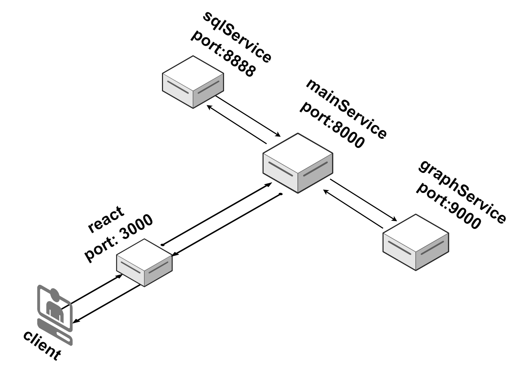

# AnalyzerData

This application build by Daniel Marko.

## Info
The Backend wrote with python using FastAPI and the front in react.

In the app you can upload json or file like csv which present your data, and then you can make analyze of your data.

You can get graphs for this database, make summary and making sql command to see extract more information from the data.


## Diagram of the Micro-Service in the system



## Installation

Clone my repository, write in console:

In bash make new direction:
```bash
mkdir AnalyzerData
```
Change direction:
```bash
cd AnalyzerData
```
For build this project at the first time you need to run:

```bash
git clone https://github.com/EASS-HIT-PART-A-2024-CLASS-V/AnalyzerData.git
docker-compose up --build
```
if is exist, run:
```bash
docker-compose up
```
Wait until you have the first response 200, that means thats everything is ready:

## Running
Now, just navigate to localhost:3000

## Introdction

https://github.com/user-attachments/assets/ffd8af83-66df-45da-9ed7-b052d00160ec

